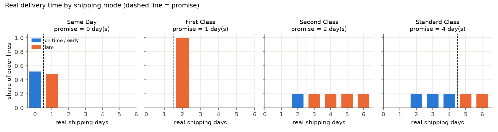
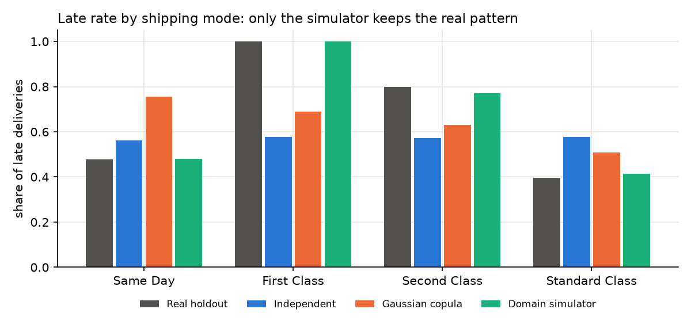
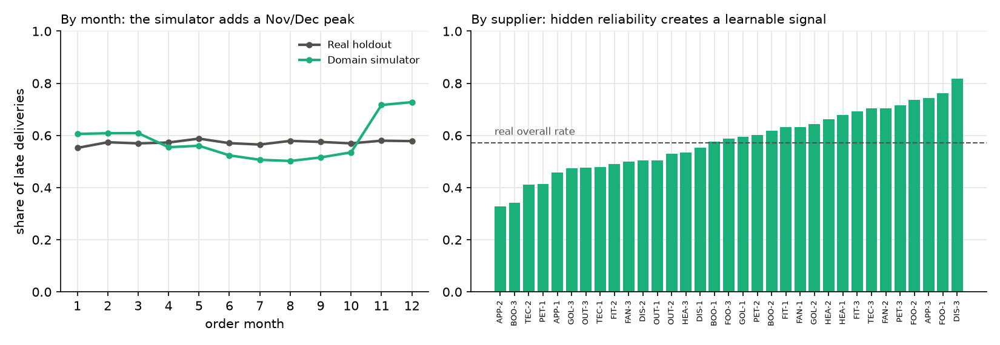

# SynthSupply: synthetic procurement and fulfilment data, and how to judge it

Models for procurement and production planning (delivery-delay prediction, supplier
choice, reorder points) need data that companies rarely share: orders, supplier
performance, delivery delays. Synthetic data is a way around that, but only if we
can **measure** whether it is representative.

This project builds three generators of order-line data and evaluates them on
**fidelity**, **utility** and **privacy** against a public reference dataset.

It is the first of three linked projects:
**P1 SynthSupply** (data) → **P2** (prediction, recommendation and optimisation on that
data) → **P3** (serving, orchestration and drift monitoring).

## 1. Reference data, and what exploring it revealed

Reference: *DataCo Smart Supply Chain* (180,519 order lines, 2015 to 2018). After removing
7,754 cancelled lines and every personal field, the reference table has 172,765 rows:
shipping mode, market, customer segment, department, payment type, quantity, unit price,
discount, order month and weekday, scheduled and real shipping days, and a `late` flag.

The exploratory analysis (`scripts/explore.py`, full report in [`results/eda/eda.md`](results/eda/eda.md))
showed that DataCo is itself synthetic, in revealing ways:

* **Promises are a fixed rule.** Scheduled days depend only on shipping mode
  (Same Day 0, First Class 1, Second Class 2, Standard Class 4), and
  `late == (real days > scheduled days)` holds for every row.
* **Delays are noise.** For Second and Standard Class, real shipping days are close to
  uniform over 2 to 6 days. Within one shipping mode, no variable (market, month,
  department, customer, payment, quantity) moves the late rate by more than a few
  points. Customer segment is statistically significant (p = 0.002), yet its effect is
  only 1.4 percentage points: detectable is not the same as useful.
* **Hidden structure.** Markets appear in time blocks (one or two per quarter), and each
  department has a small fixed price list.



This shaped the design. A good generator must keep the rules and the conditional
structures; a *useful* one should also give delays causes that a model can learn.

## 2. Three generators

| Generator | Idea | Strength | Weakness |
|---|---|---|---|
| Independent marginals | sample every column on its own | perfect per-column distributions | destroys every relationship |
| Gaussian copula (implemented from scratch) | map each column to a standard normal, learn one correlation matrix, sample and map back | learns dependencies with no domain knowledge | correlations cannot express exact rules |
| Domain simulator | a calibrated story of how an order is placed and delivered | rules hold by construction; delays have causes; controllable | only as good as the story we write |

**The simulator** calibrates every distribution on the training data (calendar, market
given month, shipping mode given segment, price list per department, delivery offset per
mode). It adds **suppliers with hidden reliability**, a **Nov/Dec peak** and **market
congestion**, combined into a risk score with mean zero. Real shipping days are drawn
from the real per-mode distribution, *exponentially tilted* by that risk:

    p_new(day) ∝ p_real(day) · exp(risk · z(day))

Because risk averages to zero, overall delay rates stay close to the real ones, but each
delay now has a cause. The `supplier_shocks` argument makes a supplier suddenly worse
(for example, FAN-1 goes from 63% to 88% late); it is used to inject drift in P3.

## 3. Evaluation protocol

DataCo is split 70/30 with a fixed seed. Generators only see the 70%; every metric is
computed against the untouched 30% holdout. The real training set is scored the same way,
as the ceiling.

* **Fidelity.** *Column shapes*: 1 − Kolmogorov-Smirnov (numeric) or 1 − total variation
  distance (categorical), per column. *Column pairs*: 1 − TVD of the joint distribution
  of each of the 78 column pairs (continuous columns binned into deciles).
  *Rule validity*: share of rows respecting the promise rule and the late rule.
* **Utility (TSTR).** Train a gradient-boosting classifier for `late` on synthetic data,
  test on the real holdout (AUC). Ceiling: train on real (TRTR). `days_real` is excluded
  from the features because it reveals the answer.
* **Privacy.** Share of synthetic rows identical to a training row, compared with the
  same share for real holdout rows (the natural collision rate in such low-cardinality
  data), and median distance to the closest training record (DCR).

## 4. Results

| Generator | Column shapes | Column pairs | Rule validity | TSTR AUC | Exact copies | Median DCR |
|---|---|---|---|---|---|---|
| *Real train (ceiling)* | 0.998 | 0.990 | 1.000 | 0.751 | 2.0% | 0.85 |
| Independent marginals | 0.997 | 0.943 | 0.204 | 0.493 | 0.0% | 1.73 |
| Gaussian copula | 0.997 | 0.954 | 0.409 | 0.709 | 0.1% | 1.51 |
| **Domain simulator** | 0.996 | **0.973** | **1.000** | **0.733** | 1.5% | 0.96 |



1. **Per-column metrics are misleading.** All three generators score about 0.997 on
   column shapes, including the one that ignores every relationship.
2. **The copula breaks business rules.** Only 41% of its rows are valid. Its five weakest
   pairs are exactly the deterministic relationships: department × price, market × month,
   shipping mode × scheduled days, real days × late, shipping mode × real days.
   A correlation matrix can say "these tend to move together", not "First Class means
   exactly one day".
3. **The simulator is the most faithful and the most useful.** A model trained only on
   its data reaches an AUC of 0.733 on real data, against 0.751 when trained on real data.
4. **No sign of memorisation.** The simulator's exact-copy rate (1.5%) is below the
   natural rate between two disjoint real samples (2.0%).
5. **A deliberate trade-off.** The simulator is slightly less faithful on `days_real`
   (0.98 instead of 0.99+) and on delays by month, because it adds causes DataCo lacks.
   In exchange it gives full rule validity, a learnable signal and control.



## 5. Run it

```bash
uv venv --python 3.12 && source .venv/bin/activate   # or: python -m venv .venv
uv pip install -r requirements.txt                    # or: pip install -r requirements.txt
bash scripts/download_data.sh

python scripts/explore.py                  # exploratory analysis  -> results/eda/
python scripts/check_generator.py copula   # quick look at one generator
python scripts/run_benchmark.py            # full comparison (~1 min) -> results/
```

Everything is seeded (`SEED = 42`) and library versions are pinned in `requirements.txt`.
Different versions of NumPy can change the copula's results in the third decimal.

## 6. Limitations and next steps

* DataCo is outbound fulfilment data, not purchase orders. Suppliers are a modelled layer,
  calibrated only through overall delay rates.
* The copula could be improved by enforcing rules after sampling, or by conditional
  sampling; comparing with deep generators (CTGAN, TVAE) is a natural extension that
  this evaluation protocol already supports.
* A detection metric (can a classifier tell real rows from synthetic ones?) would be a
  stricter test of fidelity.

## Layout

```
src/synthsupply/prepare.py      load and clean DataCo, train/holdout split
src/synthsupply/generators.py   the three generators
src/synthsupply/metrics.py      fidelity, utility and privacy metrics
scripts/explore.py              exploratory analysis
scripts/check_generator.py      quick sanity check of one generator
scripts/run_benchmark.py        full comparison
scripts/download_data.sh        fetch the reference dataset
results/                        tables and figures
```
